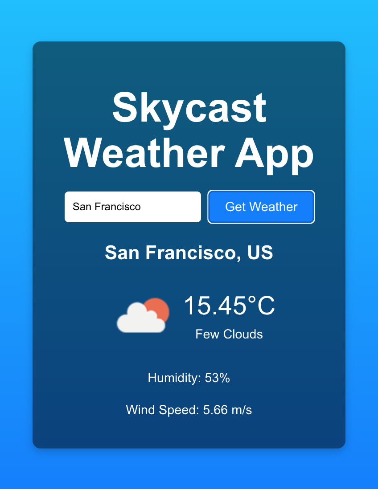

# 🌤️ Skycast Weather App

Welcome to **Skycast Weather App**! Stay updated with real-time weather information for any city around the world. Skycast provides a sleek and user-friendly interface to ensure you get the latest weather conditions with ease.




## 📋 Table of Contents

- [Features](#-Features)
- [Demo](#-Demo)
- [Installation](#-Installation)
- [Usage](#-Usage)
- [Deployment](#-Deployment)
- [Contributing](#-Contributing)
- [License](#-License)

## ✨ Features

- 🌍 **Global Weather Data:** Get current weather information for any city worldwide.
- 📅 **3-Day Forecast:** View a detailed 3-day weather forecast.
- 🌦️ **Weather Icons:** Visual representation of weather conditions with icons.
- 💧 **Humidity & Wind Speed:** Detailed weather parameters.
- 🎨 **Dynamic Backgrounds:** Background images change based on the weather conditions.
- 📱 **Responsive Design:** Works seamlessly on both desktop and mobile devices.

## 🎬 Demo

Check out the live demo of the Skycast Weather App: [Skycast Demo](https://skycast-sigma.vercel.app/)

## 🚀 Installation

To run this project locally, follow these steps:

1. **Clone the repository:**

   ```bash
   git clone https://github.com/RJoshi141/skycast.git
   cd skycast
   ```

2. **Install dependencies:**

   ```bash
   npm install
   ```

3. **Get your OpenWeatherMap API key:**

   - Sign up at [OpenWeatherMap](https://openweathermap.org/api) and get your API key.

4. **Create a `.env` file in the root directory and add your API key:**

   ```env
   REACT_APP_WEATHER_API_KEY=your_api_key_here
   ```

5. **Start the development server:**

   ```bash
   npm start
   ```

   Your app should now be running on [http://localhost:3000](http://localhost:3000).

## 📖 Usage

To use the Skycast Weather App:

1. **Enter a city name** in the search box.
2. **Click "Get Weather"** to fetch the current weather data.
3. **View detailed weather information** including temperature, humidity, wind speed, and a 3-day forecast.
4. Enjoy the dynamic backgrounds that change based on the weather conditions!

## 🌍 Deployment

Deploying the Skycast Weather App with Vercel:

1. **Build the project:**

   ```bash
   npm run build
   ```

2. **Deploy with Vercel:**

   ```bash
   vercel
   ```

   Follow the prompts to complete the deployment.

### Automated Deployment with GitHub

1. **Push your changes to GitHub:**

   ```bash
   git add .
   git commit -m "Your commit message"
   git push origin main
   ```

2. **Connect Vercel to your GitHub repository:**

   - Go to the Vercel dashboard and connect your GitHub repository.
   - Follow the prompts to set up automatic deployments.

## 🤝 Contributing

We welcome contributions to the Skycast Weather App! To contribute:

1. **Fork the repository.**
2. **Create a new branch:**

   ```bash
   git checkout -b feature/your-feature-name
   ```

3. **Make your changes.**
4. **Commit your changes:**

   ```bash
   git commit -m "Add your feature"
   ```

5. **Push to the branch:**

   ```bash
   git push origin feature/your-feature-name
   ```

6. **Open a pull request.**

## 📄 License

This project is licensed under the MIT License. See the [LICENSE](LICENSE) file for details.

---

Thank you for checking out the Skycast Weather App! We hope you enjoy using it as much as we enjoyed building it. If you have any questions or feedback, feel free to open an issue or reach out.

Happy weather watching! 🌦️
